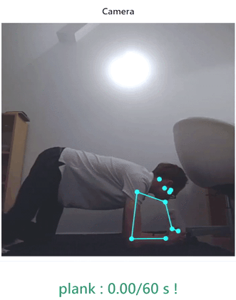

<h1 style="align-items:center;"> Workout Starter Pack  : :computer: :link: :muscle:</h1>

[](https://github.com/AlioptK/Workout-Starter-Pack/pulls)
[](https://github.com/AlioptK/Workout-Starter-Pack/issues)


<p style="flex:row" align="center">
 
 
</p>

## Table of contents
* [Introduction](#introduction)
* [Content](#content)
* [Installation](#installation)
    * [Executable](#installation-exe)
    * [Source code](#installation-source)
* [Add your own exercises!](#add-exercise)
* [Share with the community!](#sharing)
* [TODOs & possible bugs](#todos-bugs)

<a name="introduction"></a>
## Introduction

**Workout Starter Pack (WSP)** is a fully configurable community-driven workout program! Designed with the goal in mind to ```help``` its users ```develop healthier habits```, WSP is the perfect companion for every developer, remote-worker, and anyone having to stay in front of a computer all day!

### Each exercise is fully configurable with its own AI to help and supervise you! 
> **Want to share your workout plan and your custom exercises with the community?** Share them at the community's workshop (see below)!

I wanted to work out and be in shape. But I knew myself too well. I knew I wouldn't be able to commit to it for more than a couple of days before giving up and finding excuses for myself.

So, I looked at myself and -- well, I'm all day long on my laptop. So my idea was **to create a program that could schedule my workouts and somehow motivate alongside that**.
The final result is a program running in the background. 

Each time a session is starting, the program disables the mouse and keyboard's input and starts a website. The latter is then displayed onto the screen and activates the user's camera alongside an artificial intelligence.

This AI can count the pushups and squats but also time the sheathing achieved by the user. After each session, the program re-enables the mouse and keyboard. Everything is fully configurable.

I also added **mathematical functions to increase the difficulty of the exercises over time**. 

*By default, the program won't disable your mouse and keyboard. But if you want to, you also can activate it in the configuration file*.

<a name="content"></a>
## What is in this pack?
 - Customizable exercises and workout sessions :
      - **Customize**, for each exercise, **the number of repetitions** you have to do overtime
      - **Create a sequence by selecting one or multiple exercises** from the list of the already installed ones
      - **Randomize your sequences** (or not)
      - **Create and import your exercises**
 - **An AI which analyzes your movements by counting your repetitions or time your position**
 - **Two modes** were added : 
     - One that runs a session ```every N seconds``` throughout the whole day
     - Another that works by ```intervals of hours```, allowing you to ```run N sessions each interval``` 
 
### The Starter Pack comes with three basic exercises :
  - Pushups: the AI will ```count your pushups```.
  - Squats: the AI will ```count your squats```.
  - Sheathing: the AI will ```time you```.

### The exercise you were looking for isn't on the list? Add it and let the community use it (see [here](#sharing))!

#### To disable your mouse and your keyboard during each session go to ```config/config.ini```, then under ```[INPUTS]``` turn everything to ```true```.

<a name="installation"></a>
## Installation : 

<a name="installation-exe"></a>
### Prerequisites :
:warning: In order to use this program you want to have a **laptop equiped with a front facing camera**

### Installing the executable :
1) **Download the executable** [here (latest version)](https://bit.ly/2T84EhW) !
2) **Extract** its content 
3) **Edit the configuration file** situated in ```config/config.ini```
4) **Run** ```Workout Starter Pack.exe``` and you should be good to go!

**An icon should appear on your taskbar** : 


You should **receive a notification** telling you the number of seconds till the next session.


#### If you want to run it on startup :

1) ```Right click``` on the executable **->** ```Create Shortcut```
2) Copy or Cut the Shortcut
3) Press ``` WIN + R ```
4) Enter ``` shell:startup ```
5) Press ENTER
5) Paste the shortcut


<a name="installation-source"></a>
### Installing the source code (python 3):

1) [Download](https://github.com/AlioptK/Workout-Starter-Pack/archive/master.zip) the project, unzip it
2) Go to the folder :
```
cd <path to the project>
```
2) Install the required modules :
```
pip install -r requirements.txt
```
3) If you want to run the program :
```
python main.py 
```

<a name="add-exercise"></a>
## How to create your own exercises

[tutorial coming soon]

<a name="sharing"></a>
## The community's workshop !

[coming soon]

<a name="todos-bugs"></a>
## TODOs & possible bugs

#### TODOS :

- Critical:
    - clean the code 
    - add tests (unittesting + mocks)
    - Use datetime instead of seconds for the timers
    - Fix the possible errors that can occure with the config file
    - Rename the project ?
- High priority:
    - Fix the tray (not closing properly and when we click on a button it breaks the CSS later on)
    - Create an UI for the configuration
    - Create the workshop
    - Add online community workshop (for the exercises and the config files)
- Ideas for later :
    - Use pyQt5's webview in order to render the webpage. It'll allow the program to close the window on its own
    - Add langage files
    - Add customized reminders such as drinking water every hour
    - Add an animation or a mini-game for the training


#### Possible bugs :

- Camera not launching because it is already used by another program 
  > If you encounter this problem and your mouse and keyboard are both disabled, press ```CTRL + ALT + SUPPR``` and close the program.
- CSS might not load if the laptop was in sleep mode
